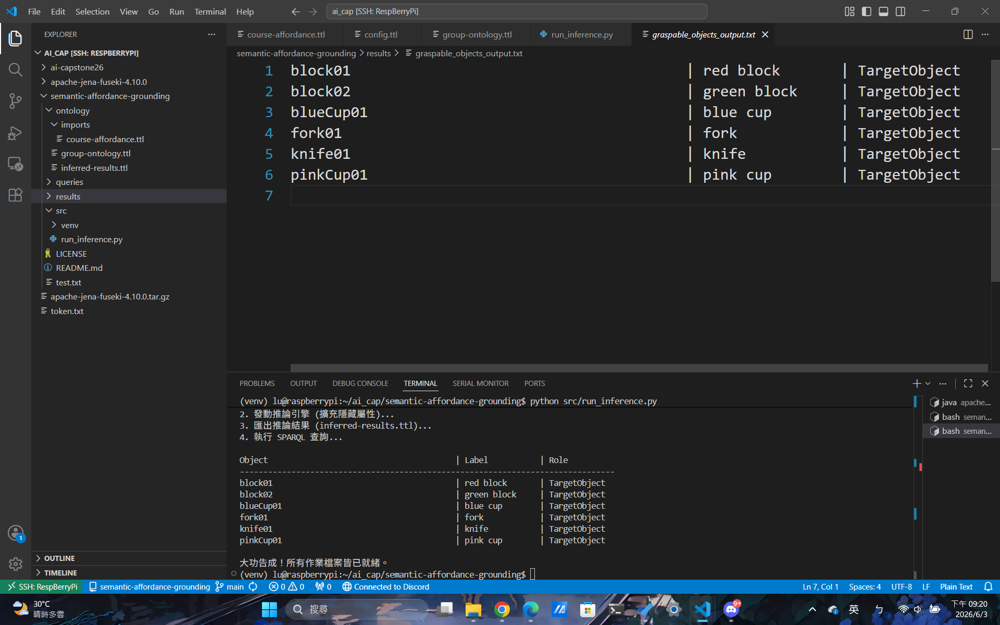
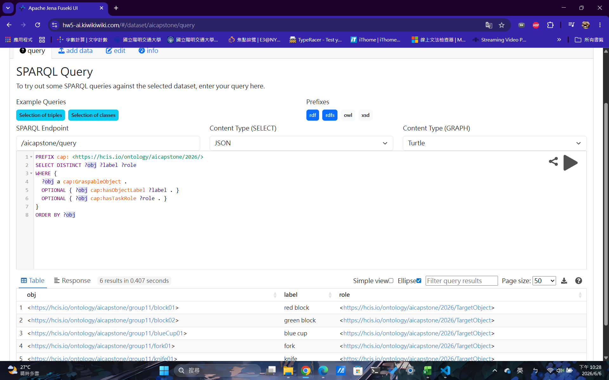
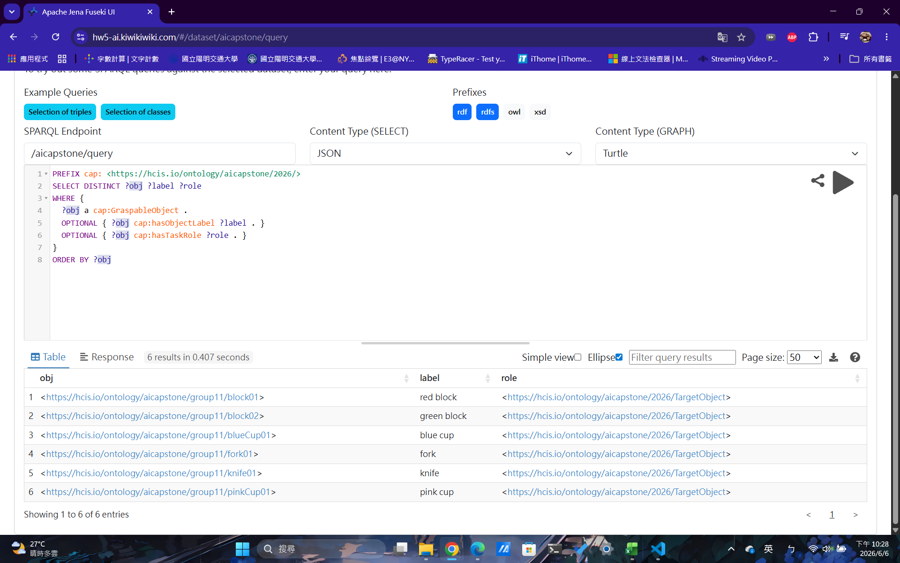
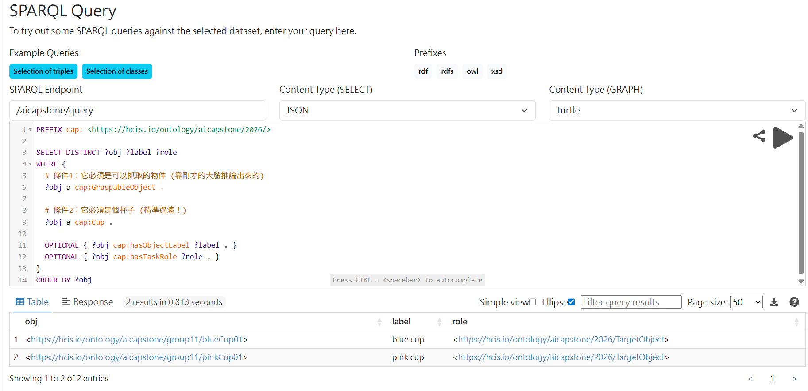

# Homework 5: Ontology-based Semantic Grounding - Final Report

**Group:** 11  
**Members:** 簡嫚萱, 周佳瑩, 劉逸安, 呂杰軒, 朱修毅

## 1. Repository Contents
This repository contains the ontology files, reasoning scripts, and SPARQL queries for Group 11. The structure is as follows:
* `ontology/`: Contains our group-authored ontology (`group-ontology.ttl`), the provided baseline ontology (`imports/course-affordance.ttl`), and the reasoner-generated output graph (`inferred-results.ttl`).
* `queries/`: Includes the baseline SPARQL query (`graspable_objects.rq`) and an advanced task-specific query (`task_objects.rq`).
* `results/`: Contains the text outputs of our SPARQL queries and Fuseki endpoint screenshots.
* `src/`: Houses our custom Python inference script (`run_inference.py`) used to perform offline Description Logic (DL) reasoning.

## 2. Ontology Design
### 2.1 Design Rationale
Our ontology enforces a strict decoupling between an object's physical type, its context-dependent task role, and its manipulation capabilities. We avoided manually asserting any object as a `GraspableObject`. Instead, we modeled the underlying affordances (e.g., `GraspingAffordance`). This design allows a robot agent to dynamically infer graspability based on logical rules rather than static labels. Furthermore, we explicitly instantiated task entities (e.g., `:cupStackingTask01`) to link specific objects to their respective tasks, enhancing the contextual richness of the semantic graph.

### 2.2 Namespace Policy
* **Shared Course Vocabulary (`cap:`):** `<https://hcis.io/ontology/aicapstone/2026/>` is used strictly for predefined core classes, properties, and affordance types provided by the course.
* **Group-Specific Namespace (`:` or `g11:`):** `<https://hcis.io/ontology/aicapstone/group11/>` is utilized for our custom instances (e.g., `:blueCup01`, `:knife01`) and task instances.

### 2.3 Reused and Newly Introduced Terms
* **Reused Terms:** We incorporated all baseline classes (`cap:Cup`, `cap:Knife`, `cap:ToyBlock`, etc.) and task roles (`cap:TargetObject`, `cap:ReferenceObject`, `cap:ContainerTarget`).
* **Newly Introduced Terms:** We introduced specific task instances such as `:cupStackingTask01 a cap:ManipulationTask` and utilized the `cap:hasTargetObject` property to establish a semantic relationship between the task and its operational targets.

## 3. Key Axioms and Reasoning Pattern
### 3.1 Core Reasoning Pattern
The central reasoning mechanism is defined by the following Description Logic (DL) axiom:
```text
cap:GraspableObject ≡ cap:PhysicalObject ⊓ ∃ cap:hasAffordance.cap:GraspingAffordance
```
This pattern asserts that any physical object possessing at least one grasping affordance is logically equivalent to a graspable object.

### 3.2 Technical Workaround and Implementation
While implementing the offline reasoning pipeline via Python on a resource-constrained Raspberry Pi, we encountered a critical serialization issue: the underlying parser often lost `owl:Restriction` and `owl:someValuesFrom` blank nodes when converting RDFLib graphs to XML for `owlready2`. 

To achieve **true DL reasoning** and bypass this bug, our script dynamically injects the equivalent class logic directly into the Python memory model using native `owlready2` APIs before invoking the reasoner:
```python
cap.GraspableObject.equivalent_to = [cap.PhysicalObject & cap.hasAffordance.some(cap.GraspingAffordance)]
```
By utilizing the embedded **HermiT Reasoner**, the system successfully classified objects based on their inherited affordances. The inferred class memberships were then systematically extracted and re-serialized into `inferred-results.ttl`.

## 4. Query Execution and Results
### 4.1 Baseline Graspable Objects Query
Our initial query effectively retrieved all objects inferred as `cap:GraspableObject`. Reference objects (`:plate01`) and containers (`:basket01`) were correctly excluded by the reasoner. 

To ensure the robustness of our semantic grounding, we verified the inferred results through two different interfaces:

**1. Local Python Inference Output (Terminal):**
We successfully executed the offline reasoning and SPARQL querying via our automated Python pipeline.


**2. Apache Jena Fuseki Web UI:**
We also deployed the exported `inferred-results.ttl` to an Apache Jena Fuseki endpoint to verify that the graph is fully queryable in a standard triple store environment.



As demonstrated in the screenshots above, the SPARQL endpoint correctly identifies the 6 graspable targets (`block01`, `block02`, `blueCup01`, `fork01`, `knife01`, `pinkCup01`) while completely filtering out non-graspable objects like plates and baskets.

### 4.2 Advanced Task-Specific Query (`task_objects.rq`)
To demonstrate how semantic layers complement robot task planning, we executed an advanced query to filter target objects exclusively for the Cup Stacking task:
```sparql
SELECT DISTINCT ?obj ?label ?role
WHERE {
  :cupStackingTask01 cap:hasTargetObject ?obj .
  ?obj a cap:GraspableObject .
  OPTIONAL { ?obj cap:hasObjectLabel ?label . }
  OPTIONAL { ?obj cap:hasTaskRole ?role . }
}
```
This query successfully narrowed down the graspable objects to only `:blueCup01` and `:pinkCup01`, proving that the robot can contextually identify targets based on task assignments.


### 4.3 Live SPARQL Endpoint Deployment (Proof of Concept)
To demonstrate the practical deployment of our semantic grounding layer in a realistic Physical AI architecture, we went beyond local testing and deployed the `inferred-results.ttl` to a live edge server. 

We containerized an **Apache Jena Fuseki** server using Docker and hosted it on a **Raspberry Pi** edge device. Furthermore, we configured a reverse proxy with SSL termination to expose the endpoint securely to the public internet.

* **Live Endpoint URL:** [https://hw5-ai.kiwikiwiki.com/](https://hw5-ai.kiwikiwiki.com/)
* **Dataset Name:** `/aicapstone`

## 5. Design Choices and Limitations
* **Selective Affordance Assignment:** We intentionally omitted the grasping affordance for plates and baskets. This choice accurately models the limitations of a standard robot gripper, which should use these objects as spatial references or containers rather than direct manipulation targets.
* **Hardware-Aware Offline Reasoning:** Running full Java-based JVM reasoners on edge devices (like Raspberry Pi) poses memory constraints. By exporting the inference as a static graph (`inferred-results.ttl`), we ensure that the robot can query the knowledge base via lightweight SPARQL endpoints in real-time without computational overhead.
